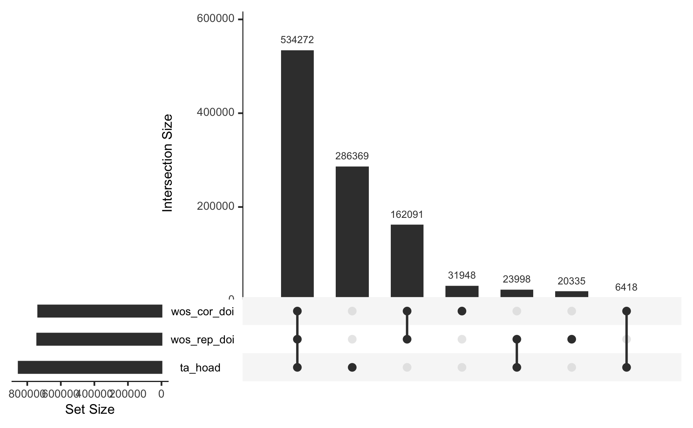

intersections
================

``` r
library(bigrquery)
library(tidyverse)
#' Connect to DB 
#' 
#' BigQuery HOAD (Crossref, OpenAlex and open friends)
bq_con <- dbConnect(
  bigrquery::bigquery(),
  billing = "subugoe-collaborative",
  project = "subugoe-collaborative"
)
```

### Overlap between sets

Set 1: HOAD articles under TA as measured by first authorship, ROR and
year match

Set 2: Replication data using WOS:TA as measured by first authorship,
ROR and year match

Set 3: WOS correspondance author under TA as measured by Correspondance
authorship, ROR and year match

``` r
hoad_ta_articles <- readr::read_csv(here::here("data-raw", "ta_oa_inst.csv.gz"))

ta_hoad <- hoad_ta_articles |>
  filter(cr_year %in% 2018:2023, ta_active == TRUE) |>
  distinct(doi)

wos_replication <- tbl(bq_con,  I("hoa-article.hoa_comparision.wos_jct_ta"))

wos_rep_doi <- wos_replication |>
  filter(pubyear %in% 2018:2023 & author_seq_nr == 1 & ta == TRUE) |>
  distinct(doi) |>
  collect()

wos_cor_doi <- wos_replication |>
  filter(pubyear %in% 2018:2023 & corresponding == TRUE & ta == TRUE) |>
  distinct(doi) |>
  collect()

my_venn <- list(ta_hoad = unlist(ta_hoad), wos_rep_doi = unlist(wos_rep_doi), wos_cor_doi = unlist(wos_cor_doi))

library(UpSetR)
upset(fromList(my_venn), order.by = "freq")
```


