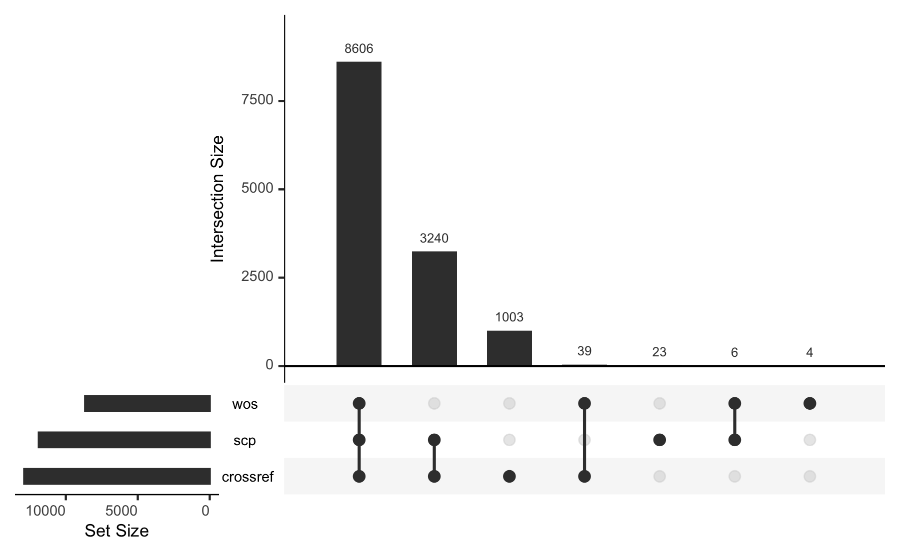
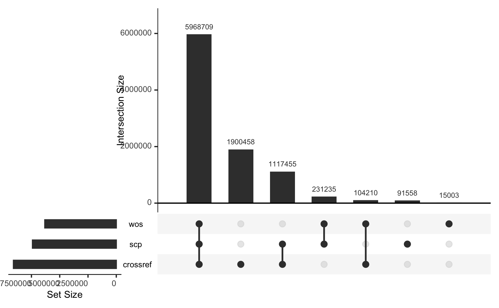
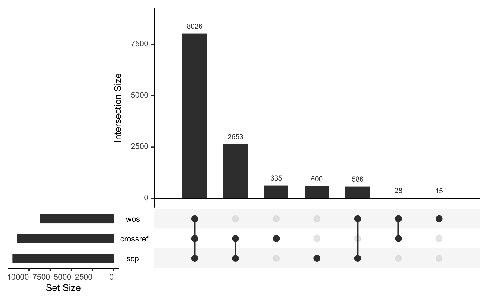
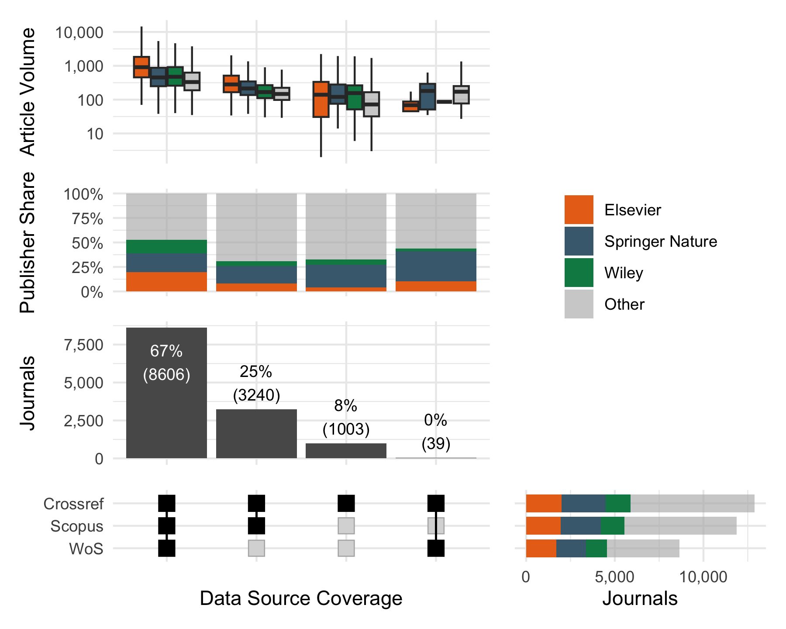

Results
================

``` r
library(bigrquery)
library(tidyverse)
library(hoaddata)
#' Connect to DB 
#' 
#' BigQuery HOAD (Crossref, OpenAlex and open friends)
bq_con <- dbConnect(
  bigrquery::bigquery(),
  billing = "subugoe-collaborative",
  project = "subugoe-collaborative"
)
```

## Research questions

Are open data sources suitable to measure transformative agreements?
More specifically, do analyses based on {hoaddata} yield comparable
results compared to WoS and Scopus?

## Journal and article volume

- Hybrid Journal coverage
- Article coverage (unsing document types)
- classification of publisher (top 3, other)

### Journal level

- JCT Journal data: `hoaddata::jct_hybrid_jns` (excluding PNAS)
- Crossref: Journal-level data on article volume including OA:
  `hoaddata::jn_ind`
- Web of Science: `data-raw/wos_jct_items.csv`

Levels:

- All
- Active: Have published at least one article between 2019 - 2023
- Hybrid OA: Have published at least one OA article between 2019 - 2023

#### Overview

HOAD:

``` r
hoad_jns <- hoaddata::jct_hybrid_jns |>
  filter(issn_l != "0027-8424")

hoad_oa_excluded <- bq_table_download("subugoe-collaborative.hoaddata.cc_oa_prop") |>
  distinct(issn_l)

active_jns <- hoad_jns |>
 # filter(!issn_l %in% hoad_oa_excluded$issn_l) |>
  inner_join(hoaddata::jn_ind, by = "issn_l") |>
  filter(!cr_year %in% c("2017", "2018", "2024"))

active_jns_with_oa <- active_jns |> 
  filter(!is.na(cc)) 
```

- Number of hybrid journals: 13,820
- Number of active hybrid journals between 2019 and 2023: 12,888
- Number of active hybrid journals with at least one OA between 2019 and
  2023: 11,342

Web of Science:

``` r
wos_jct_items_df <- readr::read_csv(here::here("data-raw", "wos_jct_items_df.csv"))

wos_hybrid_jns <- wos_jct_items_df |>
  # No PNAS
  filter(issn_l != "0027-8424") |>
  # No Full OA detected by OA prop
  filter(!issn_l %in% hoad_oa_excluded$issn_l)

wos_active_jns <- wos_hybrid_jns |>
  filter(pubyear %in% 2019:2023)

wos_active_jns_with_oa <- wos_active_jns |> 
  filter(oa_status == "hybrid") 

# wos core 
wos_active_core <- wos_active_jns |>
  filter(item_type %in% c("Article", "Review"))
```

- Number of hybrid journals: 8,666
- Number of active hybrid journals between 2019 and 2023: 8,655
- Number of active hybrid journals with at least one OA between 2019 and
  2023: 8,235

Scopus

``` r
scp_jct_items_df <- readr::read_csv(here::here("data-raw", "scp_jct_items_df.csv"))

scp_hybrid_jns <- scp_jct_items_df |>
  # No PNAS
  filter(issn_l != "0027-8424") |>
  # No Full OA detected by OA prop
  filter(!issn_l %in% hoad_oa_excluded$issn_l)

scp_active_jns <- scp_hybrid_jns |>
  filter(pubyear %in% 2019:2023) 

scp_active_jns_with_oa <- scp_active_jns |> 
  filter(grepl("hybrid", oa_status))

# core
scp_active_core <- scp_active_jns |>
   filter(grepl("^Article|^Review", item_type))

scp_active_core_oa <- scp_active_core |>
    filter(grepl("hybrid", oa_status))
```

- Number of hybrid journals: 11,905
- Number of active hybrid journals between 2019 and 2023: 11,875
- Number of active hybrid journals with at least one OA between 2019 and
  2023: 11,179

Core

- Active Journals: 11,865
- Active journals with OA: 11,159

Journals without Original Articles and Reviews (mostly Proceedings)

``` r
scp_active_jns |> 
  filter(!issn_l %in% scp_active_core$issn_l) |> 
  group_by(issn_l) |>
  summarise(items = n_distinct(item_id)) |>
  arrange(desc(items)) |>
  janitor::adorn_totals()
#>     issn_l items
#>  1071-1813   364
#>  1661-819X   340
#>  1380-7412    51
#>  2192-2624    32
#>  0267-9914    19
#>  1569-6456     4
#>  0945-358X     1
#>  1752-9298     1
#>  2332-0249     1
#>  2341-1929     1
#>      Total   814
```

### Journal analytics

Journals with items published between 2019 - 2023

``` r
library(UpSetR)

jn_list <- list(
  crossref = unique(active_jns$issn_l),
  wos = unique(wos_active_jns$issn_l),
  scp = unique(scp_active_jns$issn_l)
)

# Plot Journals Five Years Period
upset(fromList(jn_list), order.by = "freq")
```



Print out journals, which are not in Crossref, but in WoS or Scopus

WoS:

``` r
wos_active_jns |>
  filter(issn_l %in% setdiff(jn_list$wos, jn_list$crossref)) |>
  group_by(issn_l) |>
  summarise(items = n_distinct(item_id)) |>
  arrange(desc(items)) |>
  janitor::adorn_totals()
#>     issn_l items
#>  1009-1963  1743
#>  0893-7400   868
#>  1368-0668   536
#>  0011-4642   416
#>  0001-253X   326
#>  0862-7940   212
#>  0277-8033    64
#>  0967-0750    42
#>  0251-2513    28
#>  1464-1801    10
#>      Total  4245
```

(Chinese Physics B seems to have the Chinese Physics ISSN-L in WOS)

Scopus:

``` r
scp_active_jns |>
  filter(issn_l %in% setdiff(jn_list$scp, jn_list$crossref)) |>
  group_by(issn_l) |>
  summarise(items = n_distinct(item_id)) |>
  arrange(desc(items)) |>
  janitor::adorn_totals()
#>     issn_l items
#>  0094-243X 72283
#>  0893-7400   875
#>  1542-5983   615
#>  0011-4642   419
#>  0261-0159   348
#>  1661-819X   340
#>  1578-1771   335
#>  1939-8441   261
#>  0899-1855   236
#>  0862-7940   213
#>  0965-7967   154
#>  2093-761X   143
#>  0743-4154   124
#>  2095-4638   124
#>  0250-1589   102
#>  0277-8033    78
#>  1550-1949    78
#>  0039-3266    74
#>  0095-2338    59
#>  1350-7583    53
#>  1091-3211    50
#>  2157-3735    39
#>  1464-1801    31
#>  2590-1559    21
#>  0967-0750    12
#>  1861-0706    10
#>  0163-514X     8
#>  2376-1407     7
#>  0163-9269     3
#>      Total 77095
```

- `0094-243X` represents API Proceedings, all content tagged as
  proceedings article in Crossref.
- `0893-7400` changed to `1547-1896` and is present in both datasets
- `0095-2338` changed to `1549-9596`

### Item level view

``` r
cr_df <- readr::read_csv(here::here("data-raw/hoad_dois_all_19_23.csv"))


item_view_df <-  list(
  crossref = unique(cr_df$doi),
  wos = unique(unlist(wos_active_core[!is.na(wos_active_core$doi),"doi"])),
  scp = unique(unlist(scp_active_core[!is.na(scp_active_core$doi),"doi"]))
)

# Plot Journals Five Years Period
upset(fromList(item_view_df), order.by = "freq")
```



### OA View

Journals with at least one OA item according to database

``` r
jn_list_with_oa <- list(
  crossref = unique(active_jns_with_oa$issn_l),
  wos = unique(wos_active_core$issn_l),
  scp = unique(scp_active_core$issn_l)
)

upset(fromList(jn_list_with_oa), order.by = "freq")
```



#### Compose a complex upset

``` r
cr_active_upset <- cr_df |>
  group_by(issn_l) |>
  summarise(n_cr = n_distinct(doi)) |>
  mutate(crossref = TRUE)
wos_active_upset <- wos_active_core |>
  group_by(issn_l) |>
  summarise(n_wos = n_distinct(item_id)) |>
  mutate(wos = TRUE)
scp_active_upset <- scp_active_core |>
  group_by(issn_l) |>
  summarise(n_scp = n_distinct(item_id)) |>
  mutate(scopus = TRUE)

jn_upset <- dplyr::full_join(cr_active_upset, wos_active_upset, by = "issn_l") |>
  dplyr::full_join(scp_active_upset, by = "issn_l") |>
  mutate(across(c(crossref, wos, scopus), ~replace_na(.x, FALSE))) |>
  # Journal 5-years article volume
  mutate(n = case_when(!is.na(n_cr) ~ n_cr, !is.na(n_scp) ~n_scp, TRUE ~ n_wos))

library(ComplexUpset)

ComplexUpset::upset(
  jn_upset,
  c("crossref", "wos", "scopus"),
  base_annotations = list(
    `Journals` = (
      intersection_size(text_mapping=aes(label=!!upset_text_percentage())) +
        scale_y_continuous(labels =  scales::number_format(big.mark = ","))
    )
  ),
  annotations = list(
    'Article Volume' = (
      ggplot(jn_upset, aes(x = intersection, y = n)) +
        geom_boxplot(outliers = FALSE) +
        scale_y_log10(labels =  scales::number_format(big.mark = ",")) 
    ),
    'Article Violine' = (
      ggplot(jn_upset, aes(x = intersection, y = n)) +
        geom_col() +
        scale_y_continuous(labels =  scales::number_format(big.mark = ","))
    )
  )
) 
```


