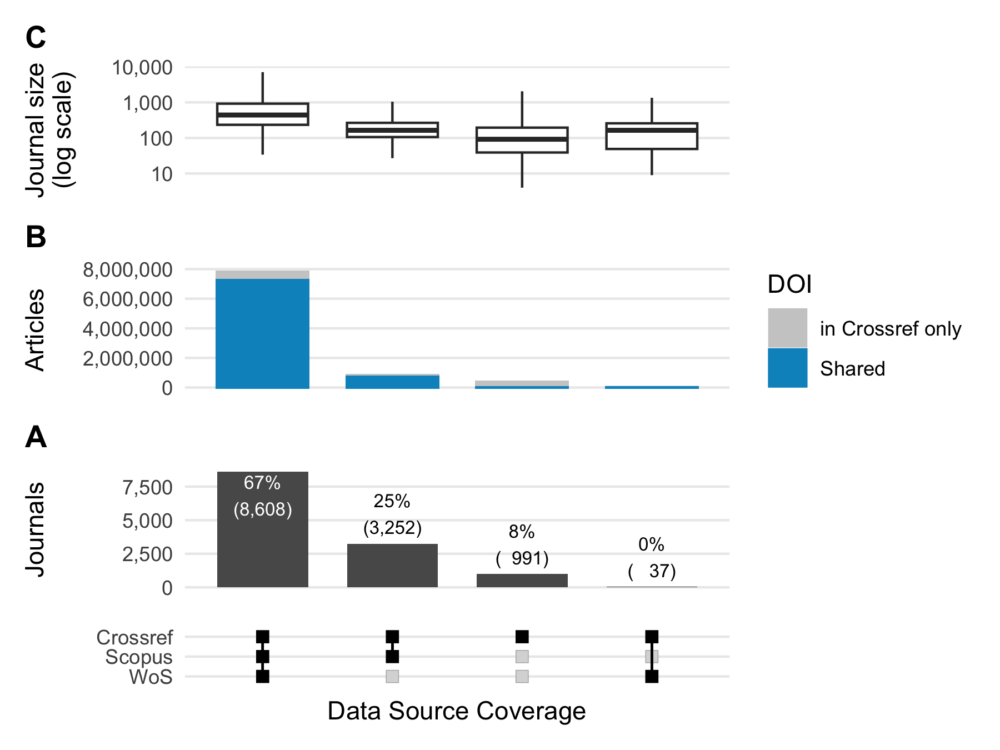

Journal and article coverage
================

``` r
library(bigrquery)
library(tidyverse)
library(hoaddata)
library(patchwork)
library(ComplexUpset)

#' Connect to DB 
#' 
#' BigQuery HOAD (Crossref, OpenAlex and open friends)
bq_con <- dbConnect(
  bigrquery::bigquery(),
  billing = "subugoe-collaborative",
  project = "subugoe-collaborative"
)

# Set themes for plots
my_base_size = 12

my_upset_theme <-
  theme(panel.grid.minor = element_blank(),
        panel.grid.major.x = element_blank(),
        plot.title.position="plot",
        plot.title = element_text(hjust = 0, vjust = 1, face = "bold"))
```

## Research questions

Are open data sources suitable to measure transformative agreements?
More specifically, do analyses based on {hoaddata} yield comparable
results compared to WoS and Scopus?

## Journal and article volume

- JCT Journal data: `hoaddata::jct_hybrid_jns` (excluding PNAS)
- Crossref: Journal-level data on article volume including OA:
  `hoaddata::jn_ind`
- Web of Science: `data-raw/wos_jct_items.csv`
- Scopus: `data-raw/scp_jct_items.csv`

Levels:

- All
- Active: Have published at least one article between 2019 - 2023
- Hybrid OA: Have published at least one OA article between 2019 - 2023

### Create analytical datasets

#### {hoaddata}

``` r
hoad_jns <- hoaddata::jct_hybrid_jns |>
  filter(issn_l != "0027-8424")

# Full OA journals detected through OA proportion > .95
hoad_oa_excluded <- bq_table_download("subugoe-collaborative.hoaddata.cc_oa_prop") |>
  distinct(issn_l)

active_jns <- hoad_jns |>
  # Only active hybrid journals from JCT
  inner_join(hoaddata::jn_ind, by = "issn_l") |>
  filter(!cr_year %in% c("2017", "2018", "2024"))

active_jns_with_oa <- active_jns |> 
  filter(!is.na(cc)) 
```

- Number of hybrid journals: 13,820
- Number of active hybrid journals between 2019 and 2023: 12,888
- Number of active hybrid journals with at least one OA between 2019 and
  2023: 11,342

#### Web of Science

``` r
wos_jct_items_df <- readr::read_csv(here::here("data-raw", "wos_jct_items_df.csv"))

wos_hybrid_jns <- wos_jct_items_df |>
  # No PNAS
  filter(issn_l != "0027-8424") |>
  # No Full OA detected by OA prop
  filter(!issn_l %in% hoad_oa_excluded$issn_l)

wos_active_jns <- wos_hybrid_jns |>
  # Use online first, if available
  mutate(online_year = lubridate::year(wos_pubdate_online)) |>
  mutate(pub_year = ifelse(!is.na(online_year), online_year, pubyear)) |>
  filter(pub_year %in% 2019:2023)

wos_active_jns_with_oa <- wos_active_jns |> 
  filter(oa_status == "hybrid") 

# wos core 
wos_active_core <- wos_active_jns |>
  filter(grepl("Article|^Review$", item_type))

wos_active_core_oa <- wos_active_jns |>
   filter(grepl("hybrid", oa_status))
```

- Number of hybrid journals: 8,666
- Number of active hybrid journals between 2019 and 2023: 8,655
- Number of active hybrid journals with at least one OA between 2019 and
  2023: 8,238

Core:

- Active Journals: 8,655
- Active journals with OA: 8,358

#### Scopus

``` r
scp_jct_items_df <- readr::read_csv(here::here("data-raw", "scp_jct_items_df.csv"))

scp_hybrid_jns <- scp_jct_items_df |>
  # No PNAS
  filter(issn_l != "0027-8424") |>
  # No Full OA detected by OA prop
  filter(!issn_l %in% hoad_oa_excluded$issn_l)

scp_active_jns <- scp_hybrid_jns |>
   # Use online first, if available
  mutate(pub_year = ifelse(!is.na(first_pubyear), first_pubyear, pubyear)) |>
  filter(pub_year %in% 2019:2023)

scp_active_jns_with_oa <- scp_active_jns |> 
  filter(grepl("hybrid", oa_status))

# core
scp_active_core <- scp_active_jns |>
   filter(grepl("^Article|^Review", item_type))

scp_active_core_oa <- scp_active_core |>
    filter(grepl("hybrid", oa_status))
```

- Number of hybrid journals: 11,905
- Number of active hybrid journals between 2019 and 2023: 11,875
- Number of active hybrid journals with at least one OA between 2019 and
  2023: 11,180

Core

- Active Journals: 11,865
- Active journals with OA: 11,160

Journals without Original Articles and Reviews (mostly Proceedings)

``` r
scp_active_jns |> 
  filter(!issn_l %in% scp_active_core$issn_l) |> 
  group_by(issn_l) |>
  summarise(items = n_distinct(item_id)) |>
  arrange(desc(items)) |>
  janitor::adorn_totals()
#>     issn_l items
#>  1071-1813   364
#>  1661-819X   340
#>  1380-7412    51
#>  2192-2624    32
#>  0267-9914    19
#>  1569-6456     4
#>  0945-358X     1
#>  1752-9298     1
#>  2332-0249     1
#>  2341-1929     1
#>      Total   814
```

## Coverage analysis: Journal and article volume

### Overview

Journals with items published between 2019 - 2023

``` r
# DOI set too large to track it with Git, see 001_data_gathering how the data
# was obtained from Google BQ
cr_df <- readr::read_csv(here::here("data-raw/hoad_dois_all_19_23.csv"))

cr_active_upset <- cr_df |>
  filter(issn_l %in% active_jns$issn_l) |>
  group_by(issn_l) |>
  summarise(n_cr = n_distinct(doi)) |>
  mutate(Crossref = TRUE)
wos_active_upset <- wos_active_jns |>
  group_by(issn_l) |>
  summarise(n_wos = n_distinct(item_id)) |>
  mutate(WoS = TRUE)
scp_active_upset <- scp_active_jns |>
  group_by(issn_l) |>
  summarise(n_scp = n_distinct(item_id)) |>
  mutate(Scopus = TRUE)

jn_upset_ <- dplyr::full_join(cr_active_upset, wos_active_upset, by = "issn_l") |>
  dplyr::full_join(scp_active_upset, by = "issn_l") |>
  mutate(across(c(Crossref, WoS, Scopus), ~ replace_na(.x, FALSE))) |>
  # Journal 5-years article volume
  mutate(n = case_when(!is.na(n_cr) ~ n_cr, !is.na(n_scp) ~ n_scp, TRUE ~ n_wos))

## DOI overlap 

doi_overlap_df <- cr_df |>
  filter(issn_l %in% active_jns$issn_l) |>
  mutate(in_wos_and_scopus = ifelse(doi %in% wos_active_jns$doi & doi %in% scp_active_jns$doi, 1, 0),
         in_scopus = ifelse(doi %in% scp_active_jns$doi, 1, 0),
         in_wos =  ifelse(doi %in% wos_active_jns$doi, 1, 0))
doi_overlap <- doi_overlap_df |>
  group_by(issn_l) |>
  summarise(
    doi_in_wos_and_scopus = sum(in_wos_and_scopus),
    doi_in_scopus = sum(in_scopus),
    doi_in_wos = sum(in_wos))

jn_upset_articles <- jn_upset_ |> 
  left_join(doi_overlap, by = "issn_l") 

# Backup
jn_upset_articles
#> # A tibble: 12,921 × 11
#>    issn_l     n_cr Crossref n_wos WoS   n_scp Scopus     n doi_in_wos_and_scopus
#>    <chr>     <int> <lgl>    <int> <lgl> <int> <lgl>  <int>                 <dbl>
#>  1 0001-0782  1467 TRUE      1625 TRUE   1464 TRUE    1467                  1282
#>  2 0001-1541  1844 TRUE      1953 TRUE   1939 TRUE    1844                  1807
#>  3 0001-2092  1359 TRUE      1463 TRUE   1040 TRUE    1359                   868
#>  4 0001-2785   875 TRUE        NA FALSE    NA FALSE    875                     0
#>  5 0001-2998   326 TRUE       336 TRUE    343 TRUE     326                   314
#>  6 0001-3072   144 TRUE       142 TRUE    141 TRUE     144                   141
#>  7 0001-3455   120 TRUE        NA FALSE    NA FALSE    120                     0
#>  8 0001-4338   793 TRUE       757 TRUE    765 TRUE     793                   723
#>  9 0001-4346  1108 TRUE      1023 TRUE    993 TRUE    1108                   988
#> 10 0001-4370   526 TRUE       526 TRUE    525 TRUE     526                   525
#> # ℹ 12,911 more rows
#> # ℹ 2 more variables: doi_in_scopus <dbl>, doi_in_wos <dbl>
write_csv(jn_upset_articles, here::here("data/jn_upset_articles.csv"))
```

``` r
# Helper function to make text labels the same size as axis labels as seen in
# <https://wjschne.github.io/posts/making-text-labels-the-same-size-as-axis-labels-in-ggplot2/>
# Todo: Learn how to invoke it
ggtext_size <- function(base_size, ratio = 0.8) {
  ratio * base_size / ggplot2::.pt
}

bar_width <- 0.7
size <- get_size_mode("exclusive_intersection")

upset_overview <- ComplexUpset::upset(
  jn_upset_articles,
  c("Crossref", "WoS", "Scopus"),
  # Only journals in Crossref
  min_size = 30,
  set_sizes = FALSE,
  stripes = "transparent",
  # wrap = TRUE,
  name = "Data Source Coverage",
  base_annotations = list(
    "Journals" = (
      ComplexUpset::intersection_size(
        counts = TRUE,
        text = list(size = 8 / .pt),
        text_mapping = aes(
          label = paste0(!!upset_text_percentage(), '\n(', !!size, ')'),
          colour = ifelse(!!size > 5000, 'on_bar', 'on_background'),
          y = ifelse(!!size > 5000, !!size - 4000, !!size)
        ), width = bar_width
      ) +
        scale_y_continuous(labels = scales::number_format(big.mark = ",")) +
        ggtitle("A")
    )
  ),
  annotations = list(
    "Journal size\n(log scale)" = (
      ggplot(mapping = aes(x = intersection, y = n)) +
        geom_boxplot(outliers = FALSE, width = bar_width) +
        scale_y_log10(labels =  scales::number_format(big.mark = ",")) +
        ggtitle("C")
    ),
    "Articles" = (
      ggplot(mapping = aes(y = n_cr)) +
        geom_bar(
          stat = "identity",
          color = "grey80",
          width = bar_width,
          aes(fill = "in Crossref only")
        ) +
        geom_bar(
          aes(y = doi_in_wos_and_scopus, fill = "Shared"),
          stat = "identity",
          width = bar_width,
          color = "#0093c7"
        ) +
        geom_bar(
          aes(y = doi_in_wos, fill = "Shared"),
          stat = "identity",
          width = bar_width,
          color = "#0093c7"
        ) +
        geom_bar(
          aes(y = doi_in_scopus, fill = "Shared"),
          stat = "identity",
          width = bar_width,
          color = "#0093c7"
        ) +
        scale_fill_manual(
          values = c(
            `in Crossref only` = "grey80",
            `Shared` = "#0093c7"
          ),
          name = "DOI"
        ) +
        scale_y_continuous(labels =  scales::number_format(big.mark = ",")) +
        ggtitle("B")
    )
  ),
  matrix = (intersection_matrix(geom = geom_point(
    shape = "square", size = 2
  )))
)
upset_overview & my_upset_theme
```



The plot is limited to journals, which are indexed in Crossref. However,
there are 33 journals not incldued in Crossref, but in WoS or Scopus:

``` r
jn_upset_articles |> 
  filter(Crossref == FALSE) |> 
  distinct(issn_l, n) |>
  arrange(desc(n)) |>
  janitor::adorn_totals()
#>     issn_l     n
#>  0094-243X 72283
#>  1009-1963  1743
#>  0893-7400   875
#>  1542-5983   615
#>  1368-0668   551
#>  0011-4642   419
#>  0261-0159   357
#>  1661-819X   340
#>  0001-253X   335
#>  1578-1771   335
#>  1939-8441   261
#>  0899-1855   236
#>  0862-7940   213
#>  0965-7967   155
#>  2093-761X   143
#>  0743-4154   124
#>  2095-4638   124
#>  0250-1589   102
#>  1550-1949    79
#>  0277-8033    78
#>  0039-3266    74
#>  0095-2338    59
#>  1350-7583    53
#>  1091-3211    50
#>  2157-3735    39
#>  1464-1801    31
#>  0251-2513    28
#>  2590-1559    21
#>  0967-0750    12
#>  1861-0706    10
#>  0163-514X     8
#>  2376-1407     7
#>  0163-9269     3
#>      Total 79763
```

WoS:

``` r
jn_upset_articles |>
  filter(Crossref == FALSE, Scopus == FALSE, WoS == TRUE) |>
  distinct(issn_l, n) |>
  arrange(desc(n)) |>
  janitor::adorn_totals()
#>     issn_l    n
#>  1009-1963 1743
#>  1368-0668  551
#>  0001-253X  335
#>  0251-2513   28
#>      Total 2657
```

(Chinese Physics B seems to have the Chinese Physics ISSN-L in WOS)

Scopus:

``` r
jn_upset_articles |>
  filter(Crossref == FALSE, Scopus == TRUE, WoS == FALSE) |>
  distinct(issn_l, n) |>
  arrange(desc(n)) |>
  janitor::adorn_totals()
#>     issn_l     n
#>  0094-243X 72283
#>  1542-5983   615
#>  0261-0159   357
#>  1661-819X   340
#>  1578-1771   335
#>  1939-8441   261
#>  0899-1855   236
#>  0965-7967   155
#>  2093-761X   143
#>  0743-4154   124
#>  2095-4638   124
#>  0250-1589   102
#>  1550-1949    79
#>  0039-3266    74
#>  0095-2338    59
#>  1350-7583    53
#>  1091-3211    50
#>  2157-3735    39
#>  2590-1559    21
#>  1861-0706    10
#>  0163-514X     8
#>  2376-1407     7
#>  0163-9269     3
#>      Total 75478
```

- `0094-243X` represents API Proceedings, all content tagged as
  proceedings article in Crossref.
- `0893-7400` changed to `1547-1896` and is present in both datasets
- `0095-2338` changed to `1549-9596`
- `1542-5983` for `1542-5991` used in Scopus for different journal
  (Hearing Journal, 0745-7472). `1542-5983` journal changed to
  `2771-1897` since 2009

### By publisher

``` r
# Add ESAC portfolio names
esac <- hoaddata::jct_hybrid_jns |>
  distinct(issn_l, esac_publisher) |>
  mutate(
    publisher = case_when(
      esac_publisher == "Elsevier" ~ "Elsevier",
      esac_publisher == "Springer Nature" ~ "Springer Nature",
      esac_publisher == "Wiley" ~ "Wiley",
      is.character(esac_publisher) ~ "Other"
    )) |>
  mutate(publisher =
           forcats::fct_relevel(
             publisher,
             c("Elsevier", "Springer Nature", "Wiley", "Other") 
           )) |>
  mutate(publisher = forcats::fct_rev(publisher)) |>
  distinct(issn_l, publisher)

jn_upset_publisher <- inner_join(jn_upset_articles, esac, by = "issn_l") |>
  # Because of Journal transfer, restrict choice to one portfolio
  distinct(issn_l, .keep_all = TRUE)
```

``` r
size = get_size_mode('exclusive_intersection')

upset_publisher_plot <- ComplexUpset::upset(
  jn_upset_publisher,
  c("Crossref", "WoS", "Scopus"),
  # Only journals in Crossref
  min_size = 30,
  width_ratio = 0.4,
  stripes = "transparent",
  name = "Data Source Coverage",
  base_annotations = NULL,
  annotations = list(
    "Journal size\n(log-scale)" = (
      ggplot(mapping = aes(x = intersection, y = n, fill = fct_rev(publisher))) +
        geom_boxplot(outliers = FALSE, width = bar_width) +
        scale_fill_manual(
          "",
          values = c(
            "Elsevier" = "#e9711c",
            "Springer Nature" = "#486a7e",
            "Wiley" = "#068853",
            "Other" = "#b3b3b3"
          ), guide = "none") +
        scale_y_log10(labels = scales::number_format(big.mark = ",")) +
        ggtitle("C")
    ),
    "Articles" = (
      ggplot(mapping = aes(y = n, fill = publisher, color = publisher)) +
        geom_bar(stat = "identity", width = bar_width) +
        scale_fill_manual(
          "",
          values = c(
            "Elsevier" = "#e9711c",
            "Springer Nature" = "#486a7e",
            "Wiley" = "#068853",
            "Other" = "#b3b3b3a0"
          ), guide = "none") +
        scale_color_manual(
          values = c(
            "Elsevier" = "#e9711c",
            "Springer Nature" = "#486a7e",
            "Wiley" = "#068853",
            "Other" = "#b3b3b3"
          ), guide = "none"
        ) + scale_y_continuous(labels = scales::number_format(big.mark = ",")) +
        ggtitle("B") 
    ),
    "Publisher" = (
      ggplot(mapping = aes(fill = publisher)) +
        geom_bar(stat = "count", position = "fill", width = bar_width) + 
        scale_y_continuous("Journals", labels = scales::percent_format()) +
        scale_fill_manual(
          "",
          values = c(
            "Elsevier" = "#e9711c",
            "Springer Nature" = "#486a7e",
            "Wiley" = "#068853",
            "Other" = "#b3b3b3"
          ), guide = "none") +
        ggtitle("A")
    )
  ),
  set_sizes = (
    upset_set_size(
      geom = geom_bar(aes(fill = publisher), width = 0.8), 
      position = "right"
    ) +
    scale_fill_manual(
      "",
      values = c(
        "Elsevier" = "#e9711c",
        "Springer Nature" = "#486a7e",
        "Wiley" = "#068853",
        "Other" = "#b3b3b3"
      )
    ) +
    scale_y_continuous(labels = scales::number_format(big.mark = ",")) +
    guides(fill = guide_legend(reverse = TRUE)) +
    ylab("Journals")
  ),
  guides = "over",
  matrix = (
    intersection_matrix(
      geom = geom_point(
        shape = "square",
        size = 2
      )
    )
  )
)

upset_publisher_plot & my_upset_theme 
```


What is the age of the journals?

``` r
jn_age <- jn_ind |> 
  mutate(cr_year = as.numeric(as.character(cr_year))) |> 
  filter(cr_year %in% 2019:2023) |>
  group_by(issn_l) |>
  summarise(min_year = min(cr_year),
            max_year = max(cr_year)) |>
  mutate(jn_age = max_year - min_year + 1) 
```

DOI coverage check

``` r
jn_overlap <- jn_upset |> 
  filter(Crossref == TRUE, WoS == TRUE, Scopus == TRUE)

miss_doi <- cr_df |>
  filter(issn_l %in% jn_overlap$issn_l) |> 
  filter(!doi %in% wos_active_core$doi)

# Check if it is in WOS (full)
wos_type_diff <- wos_jct_items_df |>
  filter(doi %in% miss_doi$doi) 

miss_doi |>
  filter(!doi %in% wos_type_diff$doi) |>
  sample_n(10)
```

10.1016/j.apmr.2022.08.623 -\> research poster abstract
10.1016/s1530-891x(20)39611-7 -\> research abstract
10.1007/s42835-023-01664-z -\> publsihed 2024
10.1097/yic.0000000000000534 -\> published 2024
10.1038/s41415-022-5051-7 -\> others 10.1016/j.matpr.2020.03.412 -\>
proceedings paper 10.3233/jifs-219108 -\> doi does not work
10.1136/vr.m1027 -\> paper review vet record! 10.1002/jmv.29204 -\>
indexing date 2024, pubyear 2023 10.1159/000516826 -\> subject index
